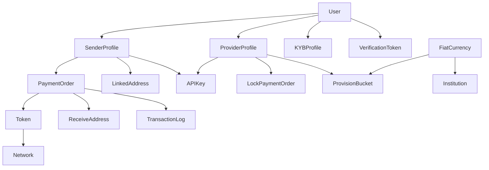

# Database Schema Analysis - NEDA Stablenode Aggregator

## Overview
This document provides a comprehensive analysis of the database schema for the NEDAPay Stablenode system. The system is built using Go with the Ent ORM framework and appears to be a cryptocurrency payment aggregation platform that connects senders, providers, and handles various payment orders and transactions.

**Note**: This analysis is based on both the Ent schema definitions and the actual PostgreSQL database schema to ensure complete accuracy.

## Key Schema Insights from SQL Database

### Important Differences Found in Actual Database:

1. **Additional Fields in Provider Profiles**:
   - `is_available`: Real-time availability status (not in Ent schema)
   - `address`, `mobile_number`, `date_of_birth`: Personal information fields
   - `business_name`: Business name separate from trading name
   - `identity_document_type`, `identity_document`, `business_document`: Document management

2. **Network Enhancements**:
   - `chain_id_hex`: Hexadecimal representation of chain ID
   - More detailed gateway contract management

3. **Join Tables for Many-to-Many Relationships**:
   - `fiat_currency_providers`: Links fiat currencies to provider profiles
   - `provision_bucket_provider_profiles`: Links provision buckets to providers

4. **System Tables**:
   - `atlas_schema_revisions`: Database migration tracking
   - `ent_types`: Entity type management

5. **Enhanced Metadata Support**:
   - JSON fields for flexible data storage in multiple entities
   - More comprehensive audit trails

## Core Architecture

The system follows a multi-tenant architecture with the following main user types:
- **Senders**: Users who initiate payment orders
- **Providers**: Users who fulfill payment orders and provide liquidity
- **System**: Administrative and operational entities

## Entity Relationships Overview

## Detailed Entity Analysis

### 1. **User** - Core User Management
**Purpose**: Central user entity that represents all system users (both senders and providers)

**Key Fields**:
- `id`: UUID primary key
- `first_name`, `last_name`: User identification
- `email`: Unique identifier and login credential
- `password`: Encrypted password (auto-hashed via hooks)
- `scope`: User scope/role definition
- `is_email_verified`: Email verification status
- `has_early_access`: Early access feature flag
- `kyb_verification_status`: KYB (Know Your Business) verification state

**Relationships**:
- **One-to-One**: `SenderProfile`, `ProviderProfile`, `KYBProfile`
- **One-to-Many**: `VerificationToken`

**Business Logic**: Users can have both sender and provider profiles, enabling dual-role functionality.

---

### 2. **SenderProfile** - Payment Initiators
**Purpose**: Represents users who initiate payment orders and send cryptocurrency

**Key Fields**:
- `webhook_url`: Callback URL for payment notifications
- `domain_whitelist`: Allowed domains for security
- `provider_id`: Optional preferred provider
- `is_partner`: Partnership status flag
- `is_active`: Profile activation status

**Relationships**:
- **Belongs to**: `User`
- **Has Many**: `PaymentOrder`, `LinkedAddress`, `SenderOrderToken`
- **Has One**: `APIKey`

**Business Logic**: Senders create payment orders and can specify preferred providers or let the system auto-assign.

---

### 3. **ProviderProfile** - Liquidity Providers
**Purpose**: Represents users who provide liquidity and fulfill payment orders

**Key Fields**:
- `id`: Custom generated 8-character string ID
- `trading_name`: Business trading name
- `host_identifier`: System identifier
- `provision_mode`: Manual or automatic order fulfillment
- `is_active`: Provider activation status
- `is_available`: Real-time availability for order assignment
- `is_kyb_verified`: KYB verification status
- `visibility_mode`: Public or private provider visibility
- `address`: Physical address
- `mobile_number`: Contact number
- `date_of_birth`: Date of birth for individual providers
- `business_name`: Legal business name (separate from trading name)
- `identity_document_type`: Type of identity document
- `identity_document`: Identity document reference/URL
- `business_document`: Business registration document reference/URL

**Relationships**:
- **Belongs to**: `User`
- **Has Many**: `LockPaymentOrder`, `ProviderCurrencies`, `ProviderOrderToken`
- **Has One**: `APIKey`, `ProviderRating`
- **Many-to-Many**: `ProvisionBucket`, `FiatCurrency` (via `fiat_currency_providers`)

**Business Logic**: Providers can operate in manual or automatic modes and are matched with payment orders based on their provision buckets and currency support. The `is_available` flag allows for real-time control of order assignment.

---

### 4. **PaymentOrder** - Core Transaction Entity
**Purpose**: Represents a payment request from sender to recipient

**Key Fields**:
- `amount`: Original payment amount
- `amount_paid`: Actually paid amount
- `amount_returned`: Refunded amount
- `percent_settled`: Settlement percentage
- `sender_fee`, `network_fee`, `protocol_fee`: Various fee components
- `rate`: Exchange rate used
- `tx_hash`: Blockchain transaction hash
- `block_number`: Blockchain block number
- `status`: Payment lifecycle status (initiated → processing → settled)
- `amount_in_usd`: USD equivalent amount

**Relationships**:
- **Belongs to**: `SenderProfile`, `Token`, `LinkedAddress`
- **Has One**: `ReceiveAddress`, `PaymentOrderRecipient`, `PaymentWebhook`
- **Has Many**: `TransactionLog`

**Business Logic**: Central entity tracking the complete payment lifecycle from initiation to settlement.

---

### 5. **LockPaymentOrder** - Provider Order Management
**Purpose**: Represents payment orders assigned to specific providers for fulfillment

**Key Fields**:
- `gateway_id`: External gateway identifier
- `amount`: Order amount
- `protocol_fee`: Protocol fee amount
- `rate`: Exchange rate
- `order_percent`: Percentage of total order
- `status`: Order status (pending → fulfilled)
- `institution`: Financial institution code
- `account_identifier`, `account_name`: Recipient account details
- `cancellation_count`: Number of cancellation attempts
- `cancellation_reasons`: Reasons for cancellations

**Relationships**:
- **Belongs to**: `Token`, `ProvisionBucket`, `ProviderProfile`
- **Has Many**: `LockOrderFulfillment`, `TransactionLog`

**Business Logic**: Enables order splitting among multiple providers and tracks fulfillment progress.

---

### 6. **Token** - Cryptocurrency Assets
**Purpose**: Defines supported cryptocurrency tokens

**Key Fields**:
- `symbol`: Token symbol (e.g., USDT, USDC)
- `contract_address`: Smart contract address
- `decimals`: Token decimal places
- `is_enabled`: Token availability status
- `base_currency`: Base currency for pricing

**Relationships**:
- **Belongs to**: `Network`
- **Has Many**: `PaymentOrder`, `LockPaymentOrder`, `SenderOrderToken`, `ProviderOrderToken`

**Business Logic**: Tokens are network-specific and define the supported cryptocurrencies for payments.

---

### 7. **Network** - Blockchain Networks
**Purpose**: Defines supported blockchain networks

**Key Fields**:
- `chain_id`: Blockchain chain identifier
- `identifier`: Network name (e.g., "ethereum", "polygon")
- `rpc_endpoint`: RPC connection URL
- `gateway_contract_address`: Smart contract address for payments
- `block_time`: Average block time
- `is_testnet`: Testnet flag
- `bundler_url`, `paymaster_url`: Account abstraction URLs
- `fee`: Network fee

**Relationships**:
- **Has Many**: `Token`
- **Has One**: `PaymentWebhook`

**Business Logic**: Networks define the blockchain infrastructure and associated tokens.

---

### 8. **FiatCurrency** - Fiat Currency Support
**Purpose**: Defines supported fiat currencies for off-ramping

**Key Fields**:
- `code`: ISO 4217 currency code
- `short_name`: Currency abbreviation
- `symbol`: Currency symbol
- `name`: Full currency name
- `market_rate`: Current exchange rate
- `is_enabled`: Currency availability

**Relationships**:
- **Has Many**: `ProviderCurrencies`, `ProvisionBucket`, `Institution`, `ProviderOrderToken`

**Business Logic**: Enables multi-currency support for fiat off-ramping.

---

### 9. **ProvisionBucket** - Liquidity Management
**Purpose**: Defines liquidity ranges that providers can fulfill

**Key Fields**:
- `min_amount`, `max_amount`: Amount range boundaries

**Relationships**:
- **Belongs to**: `FiatCurrency`
- **Has Many**: `LockPaymentOrder`
- **Many-to-Many**: `ProviderProfile`

**Business Logic**: Enables efficient order matching based on amount ranges and currency support.

---

### 10. **LinkedAddress** - Smart Account Management
**Purpose**: Manages smart contract addresses linked to user accounts

**Key Fields**:
- `address`: Smart contract address
- `salt`: Address generation salt
- `institution`: Associated financial institution
- `account_identifier`, `account_name`: Account details
- `owner_address`: Owner's wallet address
- `last_indexed_block`: Blockchain indexing state

**Relationships**:
- **Belongs to**: `SenderProfile`
- **Has Many**: `PaymentOrder`

**Business Logic**: Enables account abstraction and smart contract wallet functionality.

---

### 11. **ReceiveAddress** - Payment Address Management
**Purpose**: Manages temporary addresses for receiving payments

**Key Fields**:
- `address`: Receiving address
- `status`: Address lifecycle (unused → used → expired)
- `last_used`: Last usage timestamp
- `valid_until`: Address expiration time

**Relationships**:
- **Belongs to**: `PaymentOrder`

**Business Logic**: Provides secure, temporary addresses for payment reception.

---

### 12. **KYBProfile** - Business Verification
**Purpose**: Stores Know Your Business verification data

**Key Fields**:
- `mobile_number`: Business contact number
- `company_name`: Legal business name
- `registered_business_address`: Business address
- Document URLs for verification:
  - `certificate_of_incorporation_url`
  - `articles_of_incorporation_url`
  - `business_license_url`
  - `proof_of_business_address_url`
  - `aml_policy_url`
  - `kyc_policy_url`
- `kyb_rejection_comment`: Rejection reasons

**Relationships**:
- **Belongs to**: `User`
- **Has Many**: `BeneficialOwner`

**Business Logic**: Enables regulatory compliance for business users.

---

### 13. **BeneficialOwner** - Ownership Verification
**Purpose**: Tracks beneficial owners for KYB compliance

**Key Fields**:
- `full_name`: Owner's legal name
- `residential_address`: Owner's address
- `ownership_percentage`: Ownership stake
- `date_of_birth`: Owner's DOB
- Document URLs for verification
- `government_issued_id_type`: ID document type

**Relationships**:
- **Belongs to**: `KYBProfile`

**Business Logic**: Supports regulatory compliance by tracking business ownership.

---

### 14. **APIKey** - Authentication Management
**Purpose**: Manages API authentication for both senders and providers

**Key Fields**:
- `secret`: Encrypted API key

**Relationships**:
- **Belongs to**: `SenderProfile` OR `ProviderProfile` (exclusive)
- **Has Many**: `PaymentOrder`

**Business Logic**: Enables secure API access for automated integrations.

---

### 15. **TransactionLog** - Audit Trail
**Purpose**: Provides immutable audit trail for all system operations

**Key Fields**:
- `gateway_id`: Associated gateway
- `status`: Transaction status
- `network`: Blockchain network
- `tx_hash`: Transaction hash
- `metadata`: Additional transaction data

**Relationships**:
- **Belongs to**: `PaymentOrder` OR `LockPaymentOrder`

**Business Logic**: Ensures complete traceability of all system operations.

---

### 16. **VerificationToken** - Email/Password Management
**Purpose**: Manages email verification and password reset tokens

**Key Fields**:
- `token`: Generated verification token
- `scope`: Token purpose (emailVerification, resetPassword)
- `expiry_at`: Token expiration time

**Relationships**:
- **Belongs to**: `User`

**Business Logic**: Provides secure token-based verification workflows.

---

## Supporting Entities

### **Institution** - Financial Institutions
Defines supported banks and mobile money providers for fiat off-ramping.
- Links to specific fiat currencies
- Supports both `bank` and `mobile_money` types

### **PaymentWebhook** - Webhook Management
Manages webhook configurations for payment notifications.
- Links to both payment orders and networks
- Includes webhook secrets and callback URLs

### **ProviderCurrencies** - Provider Currency Support
Links providers to their supported fiat currencies with balance management.
- `available_balance`: Currently available for orders
- `total_balance`: Total provider balance
- `reserved_balance`: Amount reserved for pending orders
- `is_available`: Real-time availability flag

### **ProviderOrderToken** / **SenderOrderToken** - Token Preferences
Manages user preferences for specific tokens.
- **ProviderOrderToken**: Includes conversion rates, slippage tolerance, min/max amounts
- **SenderOrderToken**: Includes fee configuration and refund addresses

### **ProviderRating** - Provider Performance
Tracks provider performance and ratings.
- `trust_score`: Calculated trust/performance score

### **PaymentOrderRecipient** - Recipient Details
Stores recipient information for payment orders.
- Institution and account details
- Optional memo and metadata
- Provider assignment information

### **LockOrderFulfillment** - Fulfillment Tracking
Tracks the fulfillment progress of locked orders.
- `validation_status`: Fulfillment validation state
- `psp`: Payment service provider information
- Links to specific lock payment orders

### **IdentityVerificationRequest** - KYC Management
Manages individual identity verification requests.
- Wallet-based verification system
- Platform integration support
- Fee reclamation tracking

### **WebhookRetryAttempt** - Webhook Reliability
Tracks webhook delivery attempts and failures.
- Retry logic with exponential backoff
- Payload and signature storage
- Status tracking for delivery attempts

## Join Tables (Many-to-Many Relationships)

### **fiat_currency_providers**
Links fiat currencies to provider profiles, enabling providers to support multiple currencies.

### **provision_bucket_provider_profiles** 
Links provision buckets to provider profiles, allowing providers to participate in multiple amount ranges.

## System Management Tables

### **atlas_schema_revisions**
Tracks database schema migrations and versions.
- Migration execution tracking
- Error logging for failed migrations
- Partial hash support for complex migrations

### **ent_types**
Manages entity type definitions for the Ent ORM system.

## Key Design Patterns

### 1. **Dual-Role Users**
Users can have both sender and provider profiles, enabling flexible participation in the ecosystem.

### 2. **Order Splitting**
Large orders can be split among multiple providers through the LockPaymentOrder system.

### 3. **Temporal Address Management**
Receive addresses have lifecycle management to enhance security.

### 4. **Comprehensive Audit Trail**
All operations are logged in TransactionLog for complete traceability.

### 5. **Flexible Currency Support**
Multi-currency support through FiatCurrency and ProvisionBucket relationships.

### 6. **Regulatory Compliance**
Built-in KYB/KYC support through dedicated verification entities.

## Database Operations Guide

### Creating a New Payment Order
1. Validate sender profile and API key
2. Create PaymentOrder with required token and amount
3. Generate ReceiveAddress for payment
4. Create PaymentOrderRecipient with destination details
5. Log initial transaction state

### Provider Order Assignment
1. Query ProvisionBucket for matching amount and currency
2. Create LockPaymentOrder for matched providers
3. Update PaymentOrder status to processing
4. Log assignment transaction

### Order Fulfillment
1. Provider updates LockPaymentOrder status
2. Create LockOrderFulfillment record
3. Update PaymentOrder settlement percentage
4. Log fulfillment transaction
5. Trigger webhook notifications

### User Onboarding
1. Create User with basic information
2. Create appropriate profile (Sender/Provider)
3. Generate APIKey for API access
4. Create VerificationToken for email verification
5. Optional: Create KYBProfile for business verification

This schema provides a robust foundation for a cryptocurrency payment aggregation platform with comprehensive compliance, audit, and operational capabilities.
